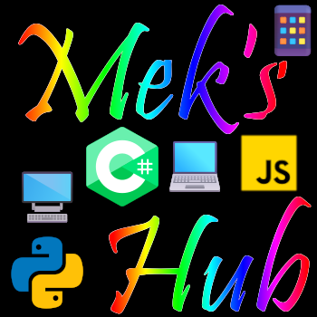

<label id="top"></label>

    

<h1 align="center">Welcome to Mek's GitHub Repository</h1>

## [Introduction](#introduction) - [Desktop && Web Apps](#desktop-&&-web-apps) - [Mobile Apps](#mobile-apps) - [Static Websites](#static-websites)

## Introduction

Hello there, and welcome to my repo! In this repo, you will find the various applications that I have built or am currently building. I may even list ideas that I may have for applications to build. I have been programming for nearly a decade now with majority of my experience being in Python. I fell in love with Python for its ease of use and readability; not to mention the fact it's super easy to learn for beginners! In my years, I have indulged myself in two other languages, C# and JavaScript. Although C# is fun at times and Python will always be my mother language, JavaScript with the capabilities of building applications in both web-app and desktop environments is just where it's at lol!

I digress. At this point in life I am in college, full-time, for my Bachelor's in Computer Science focusing in Software Development and Cyber Security. I'm not much of a game dev, but sitting down and re-creating applications that are on my computer just to see if I can do it is where I have the most fun. Side note, I also enjoy building discord bots in Python and/or JavaScript as well. Below you will find the layout of what applications I am currently building, which ones are public release, and what the applications are built using as far as the client-side framework is concerned.

[<a href="#top">Top</a>]

## Desktop Apps && Web Applications

> Desktop and Web Apps have been categorized together as the apps I develop under this category have npm commands in their package.json files to allow you to run the project in either "dev mode" which is in the web, or "public" mode which is the desktop environment build of the app. Each applications repository has a read me file with this explained futher.

I have been working with all three langauges for at least 2 years now, however, for a legit breakdown [Python](https://www.python.org) (8+), [JavaScript](https://developer.mozilla.org/en-US/docs/Web/JavaScript) (5+), [C#](https://learn.microsoft.com/en-us/dotnet/csharp/) (2+). I stick to working with various desktop frameworks like C#/[Avalonia](https://docs.avaloniaui.net), Python/[PySide6](https://wiki.qt.io/Qt_for_Python), JavaScript/[ReactJS](https://react.dev), [ElectronJS](https://www.electronjs.org/), and [NextJS](https://nextjs.org) as my primary focus is Software Development and that is where my primary expertise will lie and I want to be as versatile of a programmer as I can be hence why my desktop applications are built using web technologies. This not only allows me to follow best practices with building desktop applications, but has also allowed me to become a full-stack web developer, too. 

> Electron serves as the desktop environment wrapper around the React/Next JS client side application.

> Projects under this category that do not have an 'index.js' or 'main.js' file in the client/public folder are web apps

- Under Development:
  - [Mek's Hub](https://github.com/mekasu0124/MeksHub)
  - [Track Master Pro](https://github.com/mekasu0124/TrackMasterPro)
  - [BlackBook](https://github.com/mekasu0124/BlackBook)
  - [AddressBook](https://github.com/mekasu0124/AddressBook)
  - [DoYouRemember?](https://github.com/mekasu0124/DoYouRemember)

- Public Release:

[<a href="#top">Top</a>]

## Mobile Apps

I have dabbled a bit in [React Native](https://reactnative.dev) and although I'm no expert in the framework, I am able to get basic screens built and can *play with it*. I do plan in the future to become more rounded with this framework as almost every application I build (given it's logical) will have a mobile app companion that partners with it. My goal for my applications is to have a version for each (web, desktop, and mobile) along with an online/offline feature that checks for internet connectivity on startup. The idea is to have a *buffer type*-like system so that when the user is offline, the application can still save their data. Ideally, when the user saves anything within any application while having an internet connection, it is then posted to the database and an "offline copy" is updated on the device. This is so that when the user starts the application again, if they don't have an internet connection, the application already knows who they are (or can allow them to login an access their latest save). Once the user has regained internet connectivity and has launched the application again, the application will detect the internet connection and will then start to upload all the saved changes to the database and once the upload is complete, the application will remove the saved user data from the device to free up space and continue functioning. I also plan to try and create some sort of mitigation for if the user has the app open and running and suddenly looses internet. I'm not too sure what I'll do there.

- Mobile Applications
  - Built using:
    - JavaScript/React Native
    - I have thought about looking into Avalonia's framework even further as you can create a project that is built out for Desktop, Mobile, and Web. Unsure though....

- Under Development:

- Public Release:

[<a href="#top">Top</a>]

## Static Websites

I do love a good framework that does a lot of the heavy lifting for me, however, I do still create static websites from time to time. What I mean by a *"static website"* is a website that is built using vanilla HTML/CSS/JS. Static websites, in my opinion, are great for websites that just showcase information and do not handle things such as user accounts, debit/credit card transactions, etc. Wikipedia would be a good example of a static website if I would have built it.

- Built Using:
  - [HTML](https://developer.mozilla.org/en-US/docs/Web/HTML)
  - [CSS](https://developer.mozilla.org/en-US/docs/Web/CSS)
  - [JavaScript](https://developer.mozilla.org/en-US/docs/Web/JavaScript)

- Under Development:

- Public Release:

[<a href="#top">Top</a>]
